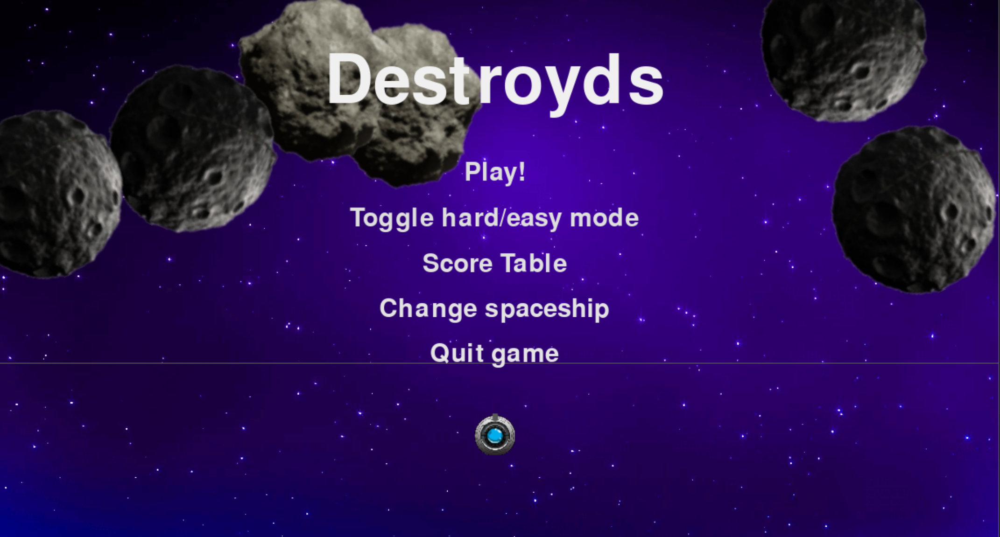
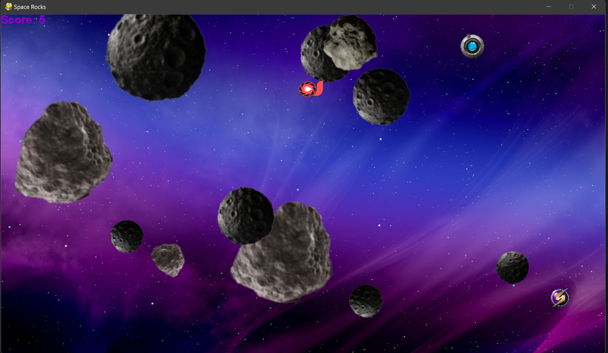

# Destroyds 🚀 
**Destroy asteroids and survive as long as you can!** 

Welcome to Destroyds, a classic arcade-inspired game created using Python and PyGame. Your mission is simple: destroy all the asteroids while keeping your spaceship intact. Test your skills and reflexes in this action-packed game with two difficulty levels, power-ups, and customizable spaceships!

## Game Rules
- **Objective**: Destroy all asteroids while keeping your ship alive to win the game.
- **Asteroids**: The game starts with 6 large asteroids, which split into medium ones when hit. Medium asteroids split again into small ones, creating a progressively challenging field.

## Menu Options
1. **Difficulty Modes**:
   - **Easy Mode**: Grants an extra life, faster power-up spawns, and rewards 0.5 points per asteroid destroyed.
   - **Hard Mode**: One life only, slightly longer intervals between power-ups, and full 1 point per asteroid.
2. **Score Table**: Shows the top three high scores. Scores are saved only after winning or losing a game.
3. **Spaceship Selection**: Choose from 4 unique spaceship designs.
4. **Quit Game**: Exits the game.

## Controls
- **Up Arrow**: Accelerate in the direction the spaceship is facing. No brakes—speed control is key!
- **Left/Right Arrows**: Rotate the spaceship.
- **Space**: Shoot up to 3 bullets simultaneously (5 with a power-up!).

## Power-Ups
During the game, power-ups spawn to aid your survival:
1. **Slow Motion**: Look for the red snail icon. Slows down all asteroids briefly, giving you some breathing room.
2. **Bullet Boost**: Temporarily increases your bullet limit to 5, allowing rapid firing.
3. **Walls**: Watch out! Hitting the wall deflects your spaceship, adding an extra layer of strategy.

## How to Play
1. **Start the Game**: Choose a difficulty mode and customize your spaceship.
2. **Destroy Asteroids**: Shoot at asteroids to break them down into smaller ones until they disappear.
3. **Stay Alive**: Avoid asteroid collisions and deflections from walls while using power-ups to your advantage.

# Screenshots

